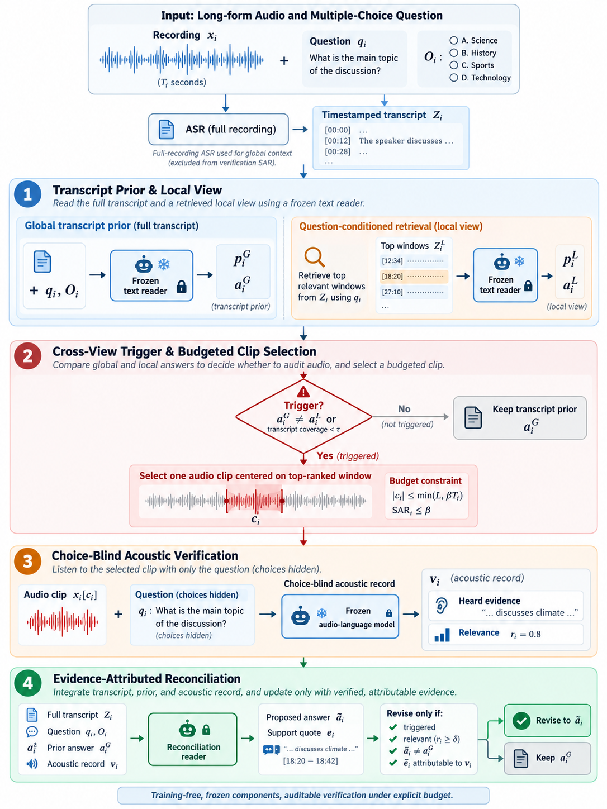

# Sanctifier

Official implementation of **Sanctifier: Budgeted Raw-Audio Verification for Long-Form Spoken Question Answering**.

Sanctifier uses a full ASR transcript for global reasoning and reopens one question-relevant waveform segment only when two transcript views disagree or the transcript is unusually sparse. A choice-blind audio-language model records local evidence, and a frozen reconciliation reader may revise the transcript prior only through an attributable evidence phrase.



## Repository scope

This repository contains the executed system path, label-isolated scoring utilities, path-free example configurations, tests, and the evaluation protocol. It deliberately excludes datasets, model weights, baseline repositories, ASR caches, official labels, per-example predictions, development traces, and intermediate or aggregate experimental results.

The filenames `aligned_pipeline_v1.py` and `aligned_pipeline_v2.py` reflect the implementation lineage. The final system uses only their evidence-construction stages together with `aligned_pipeline_v3.py` for evidence-attributed reconciliation; they are retained so the released code matches the executed pipeline.

## Structure

- `src/aligned_pipeline_v1.py`: hard cross-view trigger, clip preparation, and choice-blind waveform verification.
- `src/aligned_pipeline_v2.py`: constrained-choice transcript view scoring used by the final prior.
- `src/aligned_pipeline_v3.py`: final evidence-attributed reconciliation and evaluation.
- `src/core.py`: shared numerical and atomic-I/O utilities.
- `tools/run_aligned_reader.py`: frozen-prompt full-transcript and retrieved-view reader.
- `tools/build_duration_dev_split.py`: deterministic, label-isolated development split builder.
- `tools/score_aligned_predictions.py`: final label-reading scorer.
- `tools/run_coraal_rq2.py`: CORAAL-QA localization diagnostic.
- `configs/`: editable templates with no machine-specific paths.
- `docs/`: protocol and reproducibility boundary.
- `tests/`: lightweight unit tests.

## Installation

Python 3.12 and a CUDA-capable PyTorch environment were used in the original experiments.

```bash
python -m pip install -r requirements.txt
```

Qwen2-Audio requires the compatible upstream/vendor implementation specified by `models.vendor_root` in the audio configuration. Dataset and model access must follow their respective licenses.

## Reproduction outline

Copy the templates in `configs/`, replace every `<EDIT_ME>` path, and keep scorer labels outside all inference directories.

```bash
export PYTHONPATH="$PWD/src"

# 1. Produce frozen full-transcript and retrieved-view answers.
python tools/run_aligned_reader.py --cache-dir <ASR_CACHE> --index-path <INFERENCE_INDEX> --reader-path <TEXT_MODEL> --variant full --output-dir <FULL_OUTPUT>
python tools/run_aligned_reader.py --cache-dir <ASR_CACHE> --index-path <INFERENCE_INDEX> --reader-path <TEXT_MODEL> --bge-path <BGE_MODEL> --variant rag --output-dir <RAG_OUTPUT>

# 2. Score transcript views for the controlled prior.
python src/aligned_pipeline_v2.py --config configs/example_audio.yaml --stage preflight
python src/aligned_pipeline_v2.py --config configs/example_audio.yaml --stage score-views

# 3. Apply the hard trigger and run one choice-blind waveform audit.
python src/aligned_pipeline_v1.py prepare --config configs/example_audio.yaml
python src/aligned_pipeline_v1.py verify --config configs/example_audio.yaml

# 4. Reconcile with the transcript prior, then score in a separate step.
python src/aligned_pipeline_v3.py --config configs/example_reconcile.yaml --stage fuse
python src/aligned_pipeline_v3.py --config configs/example_reconcile.yaml --stage evaluate

python -m unittest discover -s tests -v
```

See [the frozen evaluation boundary](docs/EVALUATION_PROTOCOL.md) and [reproducibility notes](docs/REPRODUCIBILITY.md) before running an official test split.

## Important accounting note

Verification SAR measures only the deduplicated waveform duration sent to the acoustic verifier. The full-recording ASR front end still processes the complete recording and is not included in verification SAR.

## License and citation

No source-code license has been selected yet. Add a license and the final paper citation before treating this repository as a formal software release.
